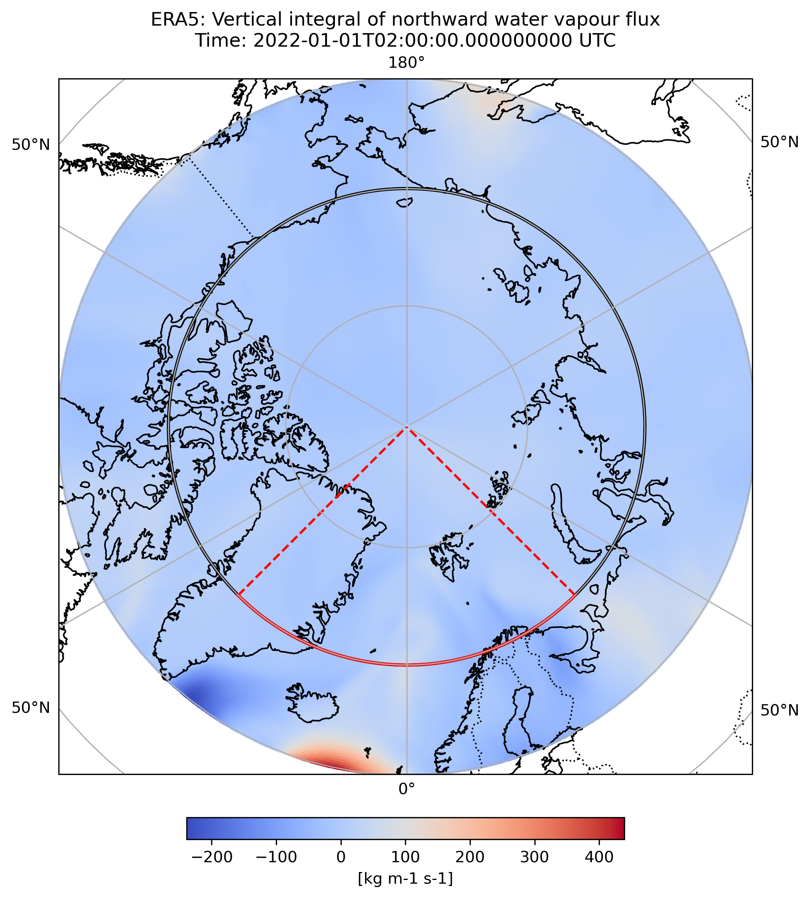

# QUESTIONS:
- SHOULD WE ACTUALLY ALSO COMPUTE THE AEROSOLS FOR A SMALLER AREA? WV CAN ACCESS FROM A LARGER AREA THAN AEROSOLS... 
- Consider statistical measure: Do we need something more sophisticated than just the correlation coefficient?

# MAIA

The MAIA project is focused on examining the correlations between water vapour transport into the arctic and aerosol concentrations in the region. The project is carried out by a team of researchers (U. Imre, P. L. Langen, and T. Quistgaard) at the Department of Environmental Science, Aarhus University.

The project is funded by ... and is part of theResearch Project ...

The project examines different aspects of the water vapour transport and aerosol concentrations in the arctic through ground-based measurements, reanalysis data, and model simulations.

#### Objectives
The objectives of the project are to:
- Examine the correlations between the water vapour transport into the arctic and aerosol concentrations in the region.
- Examine the aerosol concentrations in the arctic in terms of climatology, events, and monthly averages.
- Examine the water vapour transport into the arctic in terms of climatology, events, and monthly averages.

#### Geographical region of interest
The geographical region of interest is the arctic, more specifically set to the region 45W-45E and 70N-90N (see Figure below).
The project focuses specifically on the (Northern) Water Vapour Flux (NWVF) into the arctic along the 70N latitude line. It is assumed that the NWVF across this line is a good proxy for the transport of water vapour into the arctic.  
The aerosol concentrations are examined in the region 45W-45E and 70N-90N, thus not only across the 70N latitude line but in the whole region of interest. 

#### Aerosol concentrations
The aerosol concentrations are examined through ground-based measurements, reanalysis data, and model simulations. The model simulations are carried out with the ... model nudged with either NCEP or MERRA reanalysis data. The aerosol concentrations are examined in terms of Black Carbon, Dust, Organic Carbon, Sulphate, Sea Salt (SS), and Particulate Matter with a diameter less than 2.5 micrometers (PM2.5). The aerosol concentrations are examined in terms of climatology, events, and monthly averages. The aerosol concentrations are examined in relation to the NWVF to examine the correlations between the two.

#### Water vapour transport
The water vapour transport is examined through reanalysis data and model simulations. The model simulations are carried out with the ... model nudged with either NCEP or MERRA reanalysis data. The reanalysis data used is ERA5. The water vapour transport is examined in terms of the (Northern) Water Vapour Flux (NWVF) into the arctic along the 70N latitude line.
The water vapour transport is examined in terms of climatology, events, and monthly averages. 

### "OBSERVATIONS"
- Stations-based aerosols (Villum and Zeppelin stations) VS. ERA5 NWVF
- MERRA Nudged aerosols VS. ERA5 NWVF (full arctic slice)
- MERRA Nudged aerosols VS. MERRA NWVF (smaller arctic slice, 70N-75N)
    - Daily, 3-day rolling mean, and 7-day rolling mean
    - 7-day rolling mean with shift: NWVF [-7;0] days and aerosols [-4;+3] days.

### MODELS

### MIXED (OBSERVATIONS AND MODELS)
- NCEP Nudged aerosols VS. ERA5 NWVF
    - To see how strongly the nudging will make the the model NWVF look like the reanalysis NWVF.

## Contents of the repository

### 'Data\': contains the data used in the project
- *NCEP_MERRA_Arctic_Slice_MoistureFlux.csv*: Contains timeseries of modelled (AMIP Non-Interactive Nudged) moisture fluxes - nudged either with NCEP or MERRA reanalysis data.
- *TS_AerosolBurden_ArcticSlice.txt*: Contains timeseries of modelled aerosol concentrations (Black Carbon, Dust, Organic Carbon, Sulphate, SS and PM25) in the section 45W-45E and 70N-90N.
- *TS_AerosolBurden_ArcticSlice_small.txt*: Contains timeseries of modelled aerosol concentrations (Black Carbon, Dust, Organic Carbon, Sulphate, SS and PM25) in the section 45W-45E and 70N-75N. 

### 'Figures\': contains the figures produced in the project

- **'ModResults\'**: contains the figures produced from the model results
    - .py
- **'ObsResults\'**: contains the figures produced from the observations
    - .py
- **'MixedResults\'**: contains the figures produced from the mixed model and observation
    - .py

### **'Scripts\'**: contains the scripts used in the project for analysis and plotting

- **'Analysis\'**: contains the scripts used for the analysis
    - .py
- **'Examinations\'**: contains the scripts used for the examination of the data and testing of the scripts
    - .py
- **'Plotting\'**: contains the scripts used for the plotting
    - .py
- **'Preprocessing\'**: contains the scripts used for loading and preprocessing of the data
    - .py
- **'Results\'**: contains the results produced in the project
    - .py

- **'aerosol_meas.py'**:
- **'cdsAPI_all_MAIA_download.py'**:
- **'climatology.py'**:
- **'comp_6hr_mean.sh'**:
- **'event_analysis_class.py'**:
- **'event_analysis.py'**:
- **'MAIA__NWVF_DataProcessing.py'**:
- **'MAIA_Temp_SeaIceCover_DataProcessing.py'**:
- **'MAIA_examination.py'**:
- **'MERRA_aerosol_event_analysis.py'**:
- **'MERRA_aerosol_output.py'**:
- **'model_aerosol_climatology.py'**:
- **'model_aerosol_event_analysis.py'**:
- **'monthly_events.py'**: